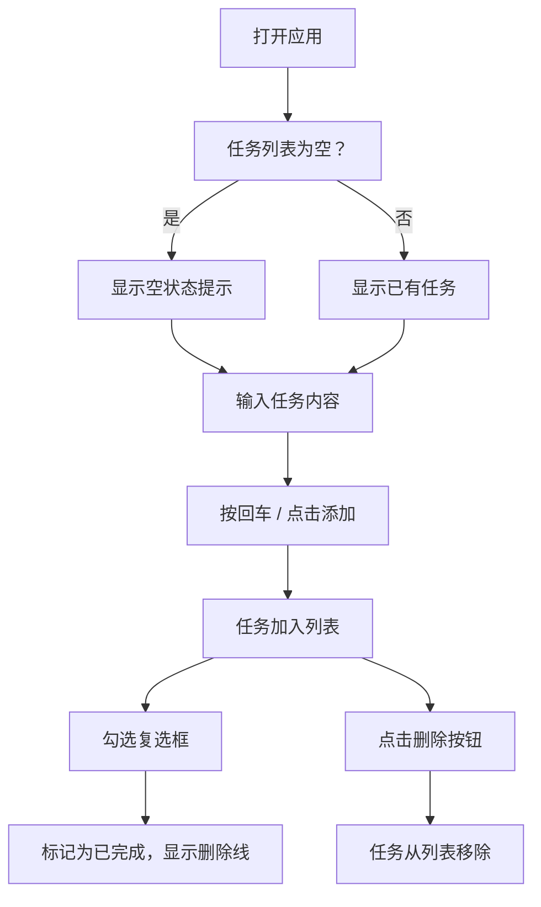

## 1. 产品概述

一款简洁现代的任务管理网页应用，帮助用户轻松记录和管理日常待办事项。支持本地存储，刷新页面后数据不丢失。面向所有需要简单任务管理的个人用户。

## 2. 核心功能

### 2.1 功能模块

1. **任务输入区**：输入框 + 添加按钮，支持回车键快捷添加
2. **任务列表**：展示所有任务项，每项包含复选框、任务文字、删除按钮
3. **统计栏**：实时显示已完成和未完成的任务数量
4. **空状态提示**：无任务时显示引导性提示

### 2.2 页面详情

| 页面名称 | 模块名称 | 功能描述 |
|---------|---------|---------|
| 主页面 | 任务输入区 | 输入任务内容，点击"添加"按钮或按回车键将任务加入列表 |
| 主页面 | 任务列表 | 展示所有任务，复选框勾选标记完成（显示删除线），点击删除按钮移除任务 |
| 主页面 | 统计栏 | 显示"已完成 X 项"和"未完成 X 项"的实时统计 |
| 主页面 | 空状态提示 | 任务列表为空时显示引导文案和图标 |

## 3. 核心流程

用户打开页面 → 输入任务内容 → 回车或点击添加 → 任务出现在列表中 → 勾选复选框标记完成 → 文字显示删除线 → 点击删除按钮移除任务

## 4. 用户界面设计

### 4.1 设计风格

- **主色调**：清新蓝色系，主色 `#4A90D9`，辅色 `#6CB4EE`
- **背景**：浅蓝灰渐变背景（`#F0F5FA` → `#E3EDF7`）
- **卡片**：白色圆角卡片，柔和阴影（`box-shadow: 0 4px 24px rgba(74,144,217,0.12)`）
- **按钮**：蓝色圆角按钮，hover 时颜色加深并微微上浮
- **输入框**：大圆角，focus 时蓝色边框光晕
- **字体**：系统默认中文字体栈，清晰易读
- **已完成任务**：灰色文字 + 删除线 + 半透明效果
- **图标**：使用 SVG 内联图标（复选框勾选、删除、空状态等）
- **动画**：任务添加/删除时的过渡动画，复选框切换动画

### 4.2 页面设计概览

| 页面名称 | 模块名称 | UI 元素 |
|---------|---------|--------|
| 主页面 | 头部标题 | 居中标题 "待办事项"，配有任务图标，蓝色渐变文字 |
| 主页面 | 任务输入区 | 圆角输入框 + 蓝色"添加"按钮，输入框占主要宽度，focus 时蓝色光晕 |
| 主页面 | 统计栏 | 两个统计卡片，分别显示完成/未完成数量，带小圆点指示色 |
| 主页面 | 任务列表 | 白色背景的任务卡片列表，每项左侧复选框 + 中间文字 + 右侧红色删除按钮 |
| 主页面 | 空状态 | 居中的大图标 + 提示文字 "还没有待办事项，快添加一个吧~" |

### 4.3 响应式设计

- 桌面端：最大宽度 520px 居中显示
- 平板端：自适应，保持 90% 宽度
- 手机端：全宽适配，输入区域占满宽度，按钮保持合适触摸尺寸（≥44px）

## 5. 技术说明

- 纯前端实现：HTML + CSS + JavaScript
- 数据持久化：使用 `localStorage` 存储任务数据
- 无外部依赖，单个 HTML 文件即可运行
