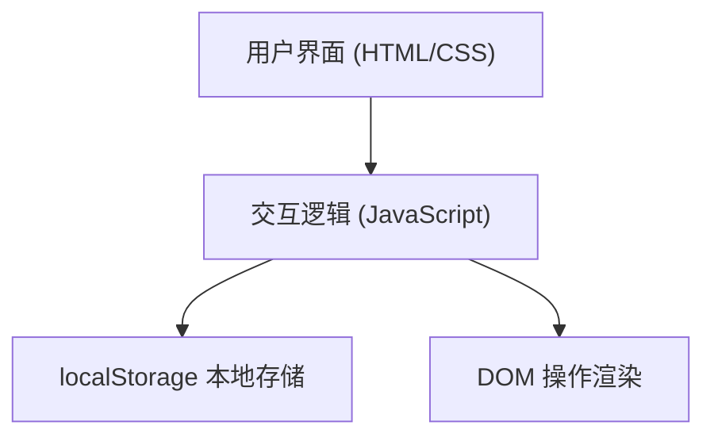

## 1. 架构设计

单文件纯前端架构，无需后端服务。



## 2. 技术描述

- **前端**：原生 HTML5 + CSS3 + Vanilla JavaScript (ES6+)
- **存储**：浏览器 localStorage
- **构建工具**：无需构建工具，单文件即可运行
- **字体图标**：内联 SVG 图标，无需外部字体库

## 3. 项目结构

```
d:\BBB\todo-app\
└── index.html          # 单文件应用，包含 HTML/CSS/JS
```

## 4. 数据模型

### 4.1 任务数据结构

```typescript
interface Task {
  id: string;        // 唯一标识，使用 Date.now() + 随机数生成
  text: string;      // 任务内容
  completed: boolean; // 是否完成
  createdAt: number;  // 创建时间戳
}
```

### 4.2 localStorage 存储

- **Key**: `todo-app-tasks`
- **Value**: `Task[]` 的 JSON 序列化字符串
- **操作**: 页面加载时读取、增删改时写入

## 5. 核心功能实现

### 5.1 功能清单

| 功能 | 实现方式 |
|------|---------|
| 添加任务 | 输入框回车或按钮点击，生成唯一 ID，写入数组 + localStorage，重新渲染列表 |
| 标记完成 | 复选框 onChange，更新 completed 状态，同步 localStorage，重新渲染 |
| 删除任务 | 点击删除按钮，从数组过滤移除，同步 localStorage，重新渲染 |
| 统计计数 | 遍历数组计算 completed/uncompleted 数量，渲染到统计区 |
| 空状态 | 数组为空时渲染空状态组件，非空时渲染任务列表 |
| 数据持久化 | 页面 onload 时从 localStorage 读取，每次操作后写回 |

### 5.2 渲染策略

- 以任务数组为唯一数据源（Single Source of Truth）
- 每次数据变更后调用统一的 `render()` 函数重新渲染整个列表
- DOM 更新采用 `innerHTML` 方式，避免复杂的虚拟 DOM
